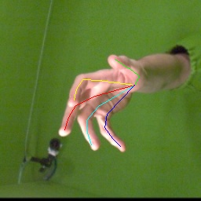
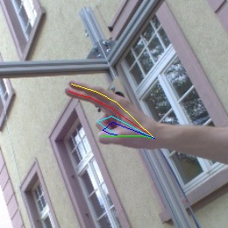
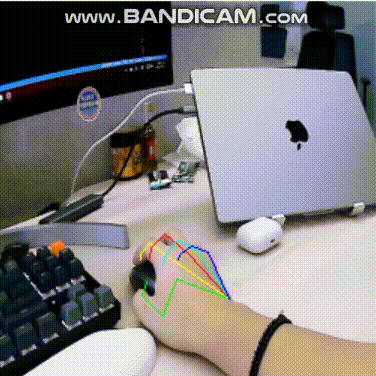

## Introduction

**Contributors:** Taeyun Woo ([taeyun.woo@kaist.ac.kr](mailto:taeyun.woo@kaist.ac.kr)), Minje Kim ([minjekim@kaist.ac.kr](mailto:minjekim@kaist.ac.kr))

This is hand pose estimation as a service work of ETRI (Electronics and Telecommunications Research Institute) service. 

  


This work is largely based on [MobRecon](https://github.com/SeanChenxy/HandMesh) study.
## Data Preprocessing

We use dataset [Hanco](https://lmb.informatik.uni-freiburg.de/resources/datasets/HanCo.en.html) and [Obman](https://www.di.ens.fr/willow/research/obman/data/). We either use ground truth 3D hand joint or 2.5D hand joint predicted by [hand landmark detection of mediapipe](https://mediapipe-studio.webapps.google.com/studio/demo/hand_landmarker). 

**2.5D:** 

```bash
# Hanco dataset
$ mv ./datasets/Hanco/preprocess.py {path_to_Hanco} 
# Obman dataset
$ mv ./datasets/Obman/train/preprocess.py {path_to_Obman}/train  
$ mv ./datasets/Obman/val/preprocess.py {path_to_Obman}/val  
$ mv ./datasets/Obman/test/preprocess.py {path_to_Obman}/test  
```

After moving preprocess file to dataset, run the preprocess file.

```bash
# Hanco dataset
$ python preprocess.py

# Obman dataset
python val/preprocess.py
python train/[preprocess.py
python test/preprocess.py
```

Then, we can earn preprocessed file .json for each dataset. 

**3D:** 

For using 3D hand joint, we don’t need any preprocess task.

## Running

### Training

```bash
python main.py --cfg configs.yaml --gpu 0 --dataset hanco
```

### Validation and Test

Include ’eval’ in PHASE in configs.yaml, and for test include ‘test’. By running same command of training, the code will run validation and test. 

### Camera Test
We present two pretrained weight. You can download it on following [link](https://drive.google.com/drive/folders/1-Xdc5hVo0R7ajtS0e14x_id_wfXffZub?usp=drive_link). Put the weight files in pretrain folder.
The middle number corresponds to image size. (e.g ETRI_256_Large.pth --> means it gets 256 input image size)

```bash
python main.py --cfg configs.yaml --gpu 0 --cam_test
```

## License

This work is based on MIT license.
